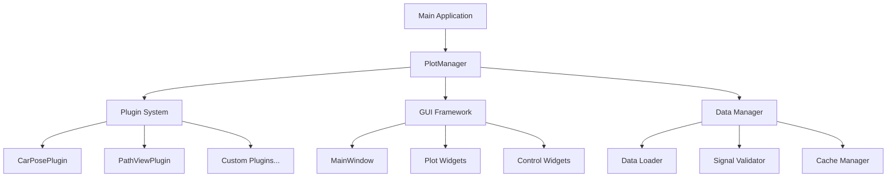
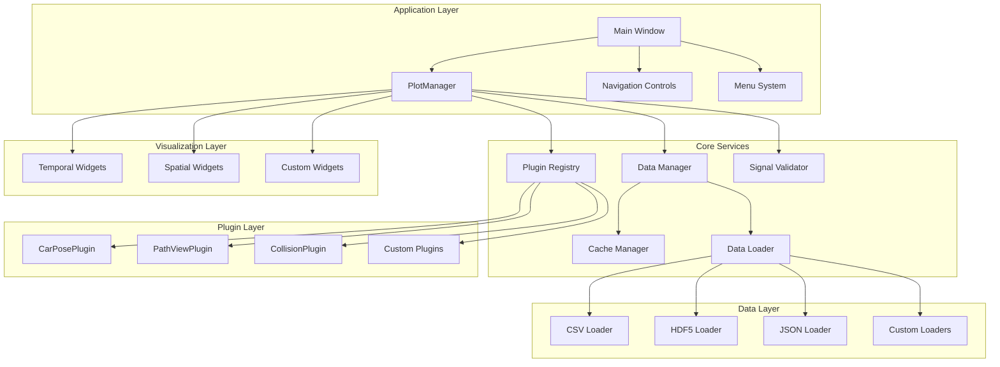
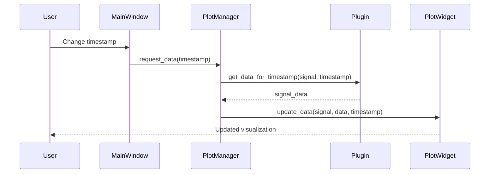

# Software Requirements Document (SRD)
## Debug Player Framework

**Document Version:** 1.0  
**Date:** December 2024  
**Author:** System Analysis Team  
**Status:** Final  

---

## Table of Contents

1. [Introduction](#introduction)
2. [System Architecture](#system-architecture)
3. [Technical Requirements](#technical-requirements)
4. [Software Design Specifications](#software-design-specifications)
5. [Interface Requirements](#interface-requirements)
6. [Data Architecture](#data-architecture)
7. [Security Requirements](#security-requirements)
8. [Performance Requirements](#performance-requirements)
9. [Reliability and Availability](#reliability-and-availability)
10. [Scalability Requirements](#scalability-requirements)
11. [Deployment and Infrastructure](#deployment-and-infrastructure)
12. [Appendices](#appendices)

---

## 1. Introduction

### 1.1 Purpose
This Software Requirements Document (SRD) defines the technical architecture, design constraints, and implementation requirements for the Debug Player Framework. It serves as the authoritative technical specification for development teams.

### 1.2 Scope
This document covers:
- System architecture and component design
- Technical implementation requirements
- Interface specifications and protocols
- Performance and scalability constraints
- Security and reliability requirements
- Deployment and infrastructure specifications

### 1.3 Audience
- Software Architects and Senior Engineers
- Development Team Leads
- DevOps and Infrastructure Teams
- Quality Assurance Engineers
- Technical Project Managers

### 1.4 Document Conventions
- **SHALL/MUST**: Mandatory requirements
- **SHOULD**: Recommended requirements
- **MAY**: Optional requirements
- **SRD-XXX**: Unique requirement identifiers

---

## 2. System Architecture

### 2.1 High-Level Architecture

#### 2.1.1 Architectural Style
**SRD-001:** The system SHALL implement a plugin-based architecture following the Model-View-Controller (MVC) pattern with the following characteristics:
- **Plugin Framework**: Modular, extensible plugin system for data sources
- **Central Coordinator**: PlotManager serves as the primary controller
- **Separation of Concerns**: Clear separation between data, presentation, and control logic
- **Event-Driven Design**: Loose coupling through signal/slot mechanisms

#### 2.1.2 Core Components
**SRD-002:** The system SHALL consist of the following primary components:



### 2.2 Component Architecture

#### 2.2.1 PlotManager (Central Controller)
**SRD-003:** The PlotManager component SHALL implement the following responsibilities:
- **Plugin Registration**: Dynamic discovery and registration of plugins
- **Signal Coordination**: Management of signal-to-plot assignments
- **Data Flow Control**: Orchestration of data requests and updates
- **Event Broadcasting**: Distribution of timestamp and navigation events

**Technical Specifications:**
- **Language**: Python 3.8+
- **Design Pattern**: Singleton with observer pattern implementation
- **Threading**: Main thread execution with thread-safe data access
- **Memory Management**: Automatic garbage collection with manual cache control

#### 2.2.2 Plugin System Architecture
**SRD-004:** The plugin system SHALL implement a standardized architecture:

```python
# Plugin Interface Specification
class PluginBase(ABC):
    """Base class for all Debug Player plugins"""
    
    @abstractmethod
    def __init__(self, file_path: str):
        """Initialize plugin with data source path"""
        
    @abstractmethod
    def has_signal(self, signal: str) -> bool:
        """Check if plugin provides specified signal"""
        
    @abstractmethod
    def get_data_for_timestamp(self, signal: str, timestamp: float) -> Dict:
        """Retrieve signal data for specific timestamp"""
        
    @property
    @abstractmethod
    def signals(self) -> Dict[str, Dict]:
        """Dictionary of provided signals with metadata"""
```

#### 2.2.3 GUI Framework Architecture
**SRD-005:** The GUI framework SHALL be built on PySide6/Qt6 with the following structure:
- **Main Window**: Central container with dockable widget support
- **Plot Widgets**: Specialized visualization components using PyQtGraph
- **Control Widgets**: Navigation and configuration interfaces
- **Layout Manager**: Dynamic layout with persistence support

### 2.3 Data Flow Architecture

#### 2.3.1 Data Processing Pipeline
**SRD-006:** The system SHALL implement a standardized data processing pipeline:

```
[Data Source] → [Plugin Loader] → [Signal Validator] → [Cache Layer] → [Plot Manager] → [Visualization Widgets]
                      ↓                    ↓                  ↓              ↓
                 [Error Handler]    [Type Converter]    [Performance Monitor] [Update Coordinator]
```

#### 2.3.2 Event Flow Architecture
**SRD-007:** The system SHALL implement event-driven communication:
- **Timestamp Events**: Navigation changes broadcast to all subscribers
- **Data Events**: New data availability notifications
- **UI Events**: User interaction events routed through central dispatcher
- **Plugin Events**: Plugin lifecycle and status change notifications

---

## 3. Technical Requirements

### 3.1 Programming Language and Framework Requirements

#### 3.1.1 Core Language Requirements
**SRD-008:** The system SHALL be implemented with the following language specifications:
- **Primary Language**: Python 3.8+ (3.12 recommended)
- **Compatibility**: Forward compatible to Python 3.13
- **Coding Standards**: PEP 8 compliance with automated enforcement
- **Type Hints**: Mandatory type annotations for all public interfaces

#### 3.1.2 Framework Requirements
**SRD-009:** The system SHALL utilize the following frameworks:
- **GUI Framework**: PySide6 (Qt for Python 6.x)
- **Plotting Library**: PyQtGraph for real-time plotting
- **Data Processing**: Pandas 2.x for data manipulation
- **Numerical Computing**: NumPy 1.21+ for mathematical operations
- **File I/O**: Native Python with h5py, pyarrow for specialized formats

#### 3.1.3 Development Environment
**SRD-010:** The development environment SHALL include:
- **Package Manager**: Conda with environment.yml specification
- **Testing Framework**: pytest with coverage reporting
- **Code Quality**: pylint, black, isort for code quality enforcement
- **Documentation**: Sphinx with autodoc for API documentation

### 3.2 Dependency Management

#### 3.2.1 Core Dependencies
**SRD-011:** The system SHALL maintain the following core dependencies:

```yaml
# Core Dependencies (environment.yml excerpt)
dependencies:
  - python=3.12
  - pyside6>=6.4.0
  - pyqtgraph>=0.13.0
  - pandas>=2.0.0
  - numpy>=1.21.0
  - scipy>=1.9.0
  - matplotlib>=3.6.0
  - h5py>=3.7.0
  - pyarrow>=10.0.0
```

#### 3.2.2 Development Dependencies
**SRD-012:** Development tools SHALL include:

```yaml
# Development Dependencies
pip:
  - pytest>=7.1.0
  - pytest-cov>=4.0.0
  - pytest-qt>=4.2.0
  - black>=22.0.0
  - pylint>=2.15.0
  - sphinx>=5.0.0
  - pre-commit>=2.20.0
```

#### 3.2.3 Optional Dependencies
**SRD-013:** Optional features MAY include:
- **Performance**: numba for JIT compilation
- **Advanced Plotting**: plotly for web-based visualizations
- **Database**: sqlalchemy for database connectivity
- **Cloud**: boto3 for AWS integration

### 3.3 System Integration Requirements

#### 3.3.1 Operating System Support
**SRD-014:** The system SHALL support the following operating systems:
- **Primary**: Linux (Ubuntu 20.04+, CentOS 8+, RHEL 8+)
- **Secondary**: Windows 10/11 (x64)
- **Future**: macOS 11+ (Apple Silicon and Intel)

#### 3.3.2 Hardware Requirements
**SRD-015:** The system SHALL operate within the following hardware constraints:

| Component | Minimum | Recommended | Maximum |
|-----------|---------|-------------|---------|
| RAM | 8 GB | 16 GB | 64 GB |
| CPU | 4 cores, 2.5 GHz | 8 cores, 3.0 GHz | 32 cores |
| Storage | 10 GB free | 100 GB free | 1 TB |
| GPU | Integrated | Dedicated OpenGL 3.3+ | Any |
| Display | 1024x768 | 1920x1080 | 4K+ |

---

## 4. Software Design Specifications

### 4.1 Design Patterns and Principles

#### 4.1.1 Architectural Patterns
**SRD-016:** The system SHALL implement the following design patterns:
- **Plugin Architecture**: Dynamic plugin discovery and loading
- **Observer Pattern**: Event notification for timestamp changes
- **Factory Pattern**: Widget and component creation
- **Strategy Pattern**: Multiple visualization strategies
- **Command Pattern**: Undoable user actions

#### 4.1.2 SOLID Principles Compliance
**SRD-017:** All components SHALL adhere to SOLID principles:
- **Single Responsibility**: Each class has one reason to change
- **Open/Closed**: Open for extension, closed for modification
- **Liskov Substitution**: Derived classes must be substitutable
- **Interface Segregation**: Clients depend only on needed interfaces
- **Dependency Inversion**: Depend on abstractions, not concretions

### 4.2 Module Design Specifications

#### 4.2.1 Core Module Structure
**SRD-018:** The system SHALL organize code in the following module structure:

```
project_root/
├── core/                    # Core system components
│   ├── plot_manager.py     # Central coordinator
│   ├── data_loader.py      # Data loading utilities
│   ├── signal_validation.py # Signal type validation
│   ├── config.py           # Configuration management
│   └── cache_handler.py    # Data caching system
├── gui/                     # User interface components
│   ├── main_window.py      # Primary application window
│   ├── custom_plot_widget.py # Visualization widgets
│   ├── control_widgets.py  # Navigation controls
│   └── dialog_managers.py  # Modal dialogs
├── plugins/                 # Plugin implementations
│   ├── CarPosePlugin.py    # Vehicle position data
│   ├── PathViewPlugin.py   # Path visualization
│   └── user_plugins/       # User-defined plugins
├── interfaces/              # Abstract interfaces
│   ├── plugin_interface.py # Plugin base classes
│   ├── data_interface.py   # Data provider interfaces
│   └── gui_interface.py    # GUI component interfaces
├── data_classes/           # Data structures
│   ├── car_pose_class.py   # Vehicle pose data
│   ├── signal_data.py      # Signal data containers
│   └── session_data.py     # Session state data
└── utils/                  # Utility functions
    ├── data_loaders/       # Format-specific loaders
    ├── spatial_poses/      # Coordinate transformations
    └── performance/        # Performance monitoring
```

#### 4.2.2 Interface Design Standards
**SRD-019:** All public interfaces SHALL follow these standards:
- **Type Annotations**: Complete type hints for all parameters and returns
- **Docstrings**: NumPy-style documentation for all public methods
- **Error Handling**: Explicit exception specifications
- **Version Compatibility**: Semantic versioning for interface changes

### 4.3 Data Structure Design

#### 4.3.1 Signal Data Structures
**SRD-020:** Signal data SHALL conform to standardized structures:

```python
# Temporal Signal Data Structure
TemporalSignal = {
    "timestamps": List[float],    # Unix timestamps in milliseconds
    "values": List[Union[float, int, str, bool]],  # Signal values
    "units": str,                 # SI units string
    "metadata": Dict[str, Any]    # Additional metadata
}

# Spatial Signal Data Structure
SpatialSignal = {
    "x": List[float],            # X coordinates
    "y": List[float],            # Y coordinates
    "z": Optional[List[float]],  # Z coordinates (3D)
    "coordinate_system": str,    # Coordinate reference
    "timestamp": float,          # Associated timestamp
    "metadata": Dict[str, Any]   # Additional metadata
}
```

#### 4.3.2 Configuration Data Structures
**SRD-021:** Configuration data SHALL use typed data classes:

```python
@dataclass
class PlotConfiguration:
    signal_assignments: Dict[str, List[str]]
    color_schemes: Dict[str, str]
    axis_settings: Dict[str, Tuple[float, float]]
    layout_preferences: Dict[str, Any]

@dataclass
class PluginConfiguration:
    enabled_plugins: List[str]
    plugin_settings: Dict[str, Dict[str, Any]]
    loading_order: List[str]
    
@dataclass
class SessionConfiguration:
    current_timestamp: float
    plot_config: PlotConfiguration
    plugin_config: PluginConfiguration
    user_preferences: Dict[str, Any]
```

---

## 5. Interface Requirements

### 5.1 Plugin Interface Specifications

#### 5.1.1 Standard Plugin Interface
**SRD-022:** All plugins SHALL implement the PluginBase interface:

```python
from abc import ABC, abstractmethod
from typing import Dict, Any, Optional, List

class PluginBase(ABC):
    """Abstract base class for all Debug Player plugins"""
    
    def __init__(self, file_path: str):
        """
        Initialize plugin with data source
        
        Args:
            file_path: Path to data source file or directory
        """
        self.file_path = file_path
        self.signals: Dict[str, Dict[str, Any]] = {}
        
    @abstractmethod
    def has_signal(self, signal: str) -> bool:
        """
        Check if plugin provides the specified signal
        
        Args:
            signal: Signal name to check
            
        Returns:
            True if signal is available, False otherwise
        """
        pass
        
    @abstractmethod
    def get_data_for_timestamp(self, signal: str, timestamp: float) -> Optional[Dict[str, Any]]:
        """
        Retrieve signal data for specific timestamp
        
        Args:
            signal: Signal name to retrieve
            timestamp: Timestamp in milliseconds since epoch
            
        Returns:
            Signal data dictionary or None if unavailable
        """
        pass
        
    def validate_signal_definition(self, signal: str) -> bool:
        """
        Validate signal definition against standards
        
        Args:
            signal: Signal name to validate
            
        Returns:
            True if valid, False otherwise
        """
        if signal not in self.signals:
            return False
            
        signal_def = self.signals[signal]
        required_fields = ["func", "type"]
        return all(field in signal_def for field in required_fields)
```

#### 5.1.2 Signal Registration Interface
**SRD-023:** Plugin signal registration SHALL follow this specification:

```python
# Signal Registration Format
signal_definition = {
    "func": callable,                    # Data retrieval function
    "type": str,                        # Signal type: temporal|spatial|categorical|boolean
    "description": str,                 # Human-readable description
    "units": Optional[str],             # SI units (e.g., "m/s", "degrees")
    "coordinate_system": Optional[str], # For spatial signals
    "valid_range": Optional[Tuple[float, float]], # Expected value range
    "sampling_rate": Optional[float],   # Hz for temporal signals
    "metadata": Optional[Dict[str, Any]] # Additional metadata
}
```

### 5.2 GUI Interface Specifications

#### 5.2.1 Plot Widget Interface
**SRD-024:** Plot widgets SHALL implement the PlotWidgetInterface:

```python
class PlotWidgetInterface(ABC):
    """Interface for all plot visualization widgets"""
    
    @abstractmethod
    def register_signal(self, signal: str, signal_info: Dict[str, Any]) -> bool:
        """Register a signal for visualization"""
        
    @abstractmethod
    def update_data(self, signal: str, data: Dict[str, Any], timestamp: float) -> None:
        """Update visualization with new data"""
        
    @abstractmethod
    def clear_data(self, signal: str) -> None:
        """Clear visualization data for signal"""
        
    @abstractmethod
    def set_time_range(self, start: float, end: float) -> None:
        """Set visible time range for temporal plots"""
        
    @abstractmethod
    def get_supported_signal_types(self) -> List[str]:
        """Return list of supported signal types"""
```

#### 5.2.2 Navigation Interface
**SRD-025:** Navigation components SHALL implement timestamp coordination:

```python
class NavigationInterface(ABC):
    """Interface for timestamp navigation components"""
    
    @abstractmethod
    def set_timestamp_range(self, start: float, end: float) -> None:
        """Set the available timestamp range"""
        
    @abstractmethod
    def set_current_timestamp(self, timestamp: float) -> None:
        """Set current navigation position"""
        
    @abstractmethod
    def get_current_timestamp(self) -> float:
        """Get current navigation position"""
        
    # Signal emitted when timestamp changes
    timestamp_changed = Signal(float)
```

### 5.3 Data Interface Specifications

#### 5.3.1 Data Loader Interface
**SRD-026:** Data loaders SHALL implement format-specific loading:

```python
class DataLoaderInterface(ABC):
    """Interface for format-specific data loaders"""
    
    @abstractmethod
    def can_load(self, file_path: str) -> bool:
        """Check if loader can handle the file format"""
        
    @abstractmethod
    def load_data(self, file_path: str) -> Dict[str, Any]:
        """Load data from file and return structured format"""
        
    @abstractmethod
    def get_metadata(self, file_path: str) -> Dict[str, Any]:
        """Extract metadata without loading full dataset"""
        
    @abstractmethod
    def validate_format(self, file_path: str) -> Tuple[bool, List[str]]:
        """Validate file format and return errors if any"""
```

---

## 6. Data Architecture

### 6.1 Data Storage Architecture

#### 6.1.1 In-Memory Data Management
**SRD-027:** The system SHALL implement efficient in-memory data structures:
- **Primary Storage**: Pandas DataFrames for structured data
- **Caching Layer**: LRU cache for frequently accessed data
- **Memory Mapping**: mmap for large file access without full loading
- **Data Types**: Optimized dtypes for memory efficiency

#### 6.1.2 Data Persistence Architecture
**SRD-028:** The system SHALL support multiple persistence formats:

| Format | Use Case | Library | Performance |
|--------|----------|---------|-------------|
| CSV | Human-readable data exchange | pandas | Medium |
| HDF5 | Large numerical datasets | h5py | High |
| Parquet | Column-oriented analytics | pyarrow | High |
| JSON | Configuration and metadata | json | Low |
| Pickle | Python object serialization | pickle | Medium |

### 6.2 Data Processing Pipeline

#### 6.2.1 Data Validation Pipeline
**SRD-029:** Data SHALL pass through validation stages:

```python
def data_validation_pipeline(raw_data: Any) -> ValidatedData:
    """Multi-stage data validation pipeline"""
    
    # Stage 1: Format validation
    format_validated = validate_data_format(raw_data)
    
    # Stage 2: Type validation  
    type_validated = validate_data_types(format_validated)
    
    # Stage 3: Range validation
    range_validated = validate_data_ranges(type_validated)
    
    # Stage 4: Consistency validation
    consistency_validated = validate_data_consistency(range_validated)
    
    return consistency_validated
```

#### 6.2.2 Data Transformation Pipeline
**SRD-030:** Data transformations SHALL be composable and reversible:

```python
class DataTransform(ABC):
    """Base class for data transformations"""
    
    @abstractmethod
    def transform(self, data: Any) -> Any:
        """Apply transformation to data"""
        
    @abstractmethod
    def inverse_transform(self, data: Any) -> Any:
        """Reverse transformation if possible"""
        
    @abstractmethod
    def can_inverse(self) -> bool:
        """Check if transformation is reversible"""

# Example transformations
class CoordinateTransform(DataTransform):
    """Transform between coordinate systems"""
    
class UnitConversion(DataTransform):
    """Convert between unit systems"""
    
class DataResampling(DataTransform):
    """Resample temporal data to different frequencies"""
```

### 6.3 Caching Strategy

#### 6.3.1 Multi-Level Caching
**SRD-031:** The system SHALL implement hierarchical caching:

```python
class CacheManager:
    """Multi-level cache management system"""
    
    def __init__(self):
        self.l1_cache = {}  # In-memory cache (fast, small)
        self.l2_cache = {}  # Compressed memory cache (medium, larger)
        self.l3_cache = {}  # Disk cache (slow, persistent)
        
    def get_data(self, key: str) -> Optional[Any]:
        """Retrieve data from cache hierarchy"""
        # Check L1 (fastest)
        if key in self.l1_cache:
            return self.l1_cache[key]
            
        # Check L2 (medium)
        if key in self.l2_cache:
            data = decompress(self.l2_cache[key])
            self.l1_cache[key] = data  # Promote to L1
            return data
            
        # Check L3 (slowest)
        if key in self.l3_cache:
            data = load_from_disk(self.l3_cache[key])
            self.l1_cache[key] = data  # Promote to L1
            return data
            
        return None
```

---

## 7. Security Requirements

### 7.1 Plugin Security

#### 7.1.1 Plugin Sandbox Environment
**SRD-032:** Plugin execution SHALL be contained within security boundaries:
- **File System Access**: Restricted to specified data directories
- **Network Access**: Prohibited unless explicitly enabled
- **System Calls**: Limited to safe operations only
- **Memory Access**: Isolated memory space with limits

#### 7.1.2 Plugin Validation
**SRD-033:** Plugin loading SHALL include security validation:

```python
class PluginSecurityValidator:
    """Security validation for plugin code"""
    
    FORBIDDEN_IMPORTS = [
        'os.system', 'subprocess', 'eval', 'exec',
        'socket', 'urllib', 'requests'
    ]
    
    ALLOWED_FILE_EXTENSIONS = ['.csv', '.json', '.h5', '.parquet']
    
    def validate_plugin_code(self, plugin_path: str) -> Tuple[bool, List[str]]:
        """Validate plugin code for security issues"""
        
    def validate_file_access(self, file_path: str) -> bool:
        """Validate file access permissions"""
        
    def create_sandbox_environment(self) -> Dict[str, Any]:
        """Create restricted execution environment"""
```

### 7.2 Data Security

#### 7.2.1 Data Access Control
**SRD-034:** Data access SHALL be controlled and audited:
- **Read Permissions**: File-level access control
- **Write Permissions**: Restricted to designated export directories
- **Audit Logging**: All data access events logged
- **Data Classification**: Support for sensitive data marking

#### 7.2.2 Data Encryption
**SRD-035:** Sensitive data SHALL support encryption:
- **At Rest**: Optional AES-256 encryption for stored sessions
- **In Transit**: TLS 1.3 for remote data sources
- **Key Management**: Secure key derivation and storage
- **User Control**: User-configurable encryption preferences

### 7.3 Application Security

#### 7.3.1 Input Validation
**SRD-036:** All user inputs SHALL be validated:
- **File Paths**: Prevent directory traversal attacks
- **Plugin Code**: Static analysis for malicious patterns
- **Configuration**: Schema validation for all settings
- **Data Content**: Sanitization of user-provided data

#### 7.3.2 Error Handling Security
**SRD-037:** Error handling SHALL not expose sensitive information:
- **Stack Traces**: Filtered for production environments
- **File Paths**: Abstracted in user-facing messages
- **System Information**: Limited disclosure of internal details
- **Logging**: Sensitive data excluded from logs

---

## 8. Performance Requirements

### 8.1 Response Time Requirements

#### 8.1.1 User Interface Responsiveness
**SRD-038:** UI components SHALL meet response time targets:

| Operation | Target Response Time | Maximum Acceptable |
|-----------|---------------------|-------------------|
| Application Startup | < 3 seconds | 5 seconds |
| File Loading (100MB) | < 2 seconds | 5 seconds |
| Plot Updates | < 500 milliseconds | 1 second |
| Navigation (timestamp change) | < 200 milliseconds | 500 milliseconds |
| Plugin Loading | < 1 second | 3 seconds |
| Export Operations | < 5 seconds | 15 seconds |

#### 8.1.2 Data Processing Performance
**SRD-039:** Data processing SHALL achieve performance targets:

```python
# Performance Benchmarks
class PerformanceTargets:
    """Performance targets for data operations"""
    
    DATA_LOADING_RATES = {
        "csv": 50_000_000,    # bytes/second
        "hdf5": 100_000_000,  # bytes/second  
        "parquet": 80_000_000 # bytes/second
    }
    
    VISUALIZATION_RATES = {
        "temporal_points": 100_000,  # points/second
        "spatial_points": 50_000,    # points/second
        "real_time_updates": 60      # fps
    }
    
    MEMORY_EFFICIENCY = {
        "data_overhead": 0.20,       # 20% overhead max
        "cache_hit_rate": 0.85,      # 85% cache hits
        "garbage_collection": 0.10   # 10% time max
    }
```

### 8.2 Memory Management

#### 8.2.1 Memory Usage Constraints
**SRD-040:** Memory usage SHALL be controlled and predictable:
- **Maximum Usage**: 4GB for datasets up to 1GB
- **Memory Leaks**: Zero tolerance for memory leaks
- **Garbage Collection**: Explicit memory management for large objects
- **Virtual Memory**: Efficient use of memory mapping for large files

#### 8.2.2 Memory Optimization Strategies
**SRD-041:** The system SHALL implement memory optimization:

```python
class MemoryOptimizer:
    """Memory optimization strategies"""
    
    def optimize_dataframe_dtypes(self, df: pd.DataFrame) -> pd.DataFrame:
        """Optimize pandas DataFrame memory usage"""
        
    def implement_lazy_loading(self, data_source: str) -> LazyDataLoader:
        """Implement lazy loading for large datasets"""
        
    def compress_cache_data(self, data: Any) -> CompressedData:
        """Compress cached data to reduce memory footprint"""
        
    def monitor_memory_usage(self) -> MemoryStats:
        """Monitor and report memory usage statistics"""
```

### 8.3 Scalability Requirements

#### 8.3.1 Data Volume Scalability
**SRD-042:** The system SHALL scale to handle large datasets:

| Dataset Size | Performance Target | Implementation Strategy |
|--------------|-------------------|------------------------|
| < 100 MB | Full in-memory | Standard loading |
| 100 MB - 1 GB | Partial virtualization | Chunked processing |
| 1 GB - 10 GB | Full virtualization | Memory mapping |
| > 10 GB | Streaming processing | Out-of-core algorithms |

#### 8.3.2 Concurrent User Support
**SRD-043:** The system SHALL support multiple concurrent operations:
- **Multi-threading**: Background data loading and processing
- **Async Operations**: Non-blocking UI during long operations
- **Resource Sharing**: Efficient sharing of cached data
- **Coordination**: Thread-safe access to shared resources

---

## 9. Reliability and Availability

### 9.1 Fault Tolerance

#### 9.1.1 Error Recovery Mechanisms
**SRD-044:** The system SHALL implement comprehensive error recovery:

```python
class ErrorRecoveryManager:
    """Centralized error recovery and handling"""
    
    def handle_plugin_failure(self, plugin_name: str, error: Exception) -> RecoveryAction:
        """Handle plugin loading or execution failures"""
        
    def handle_data_corruption(self, data_source: str, error: Exception) -> RecoveryAction:
        """Handle data corruption or format errors"""
        
    def handle_memory_exhaustion(self, operation: str) -> RecoveryAction:
        """Handle out-of-memory conditions"""
        
    def handle_ui_freezing(self, component: str) -> RecoveryAction:
        """Handle UI responsiveness issues"""

class RecoveryAction(Enum):
    RETRY = "retry"
    FALLBACK = "fallback"
    SKIP = "skip"
    ABORT = "abort"
    USER_INTERVENTION = "user_intervention"
```

#### 9.1.2 Data Integrity Protection
**SRD-045:** Data integrity SHALL be maintained through:
- **Checksums**: File integrity verification during loading
- **Validation**: Multi-stage data validation pipeline
- **Backup**: Automatic session state backup
- **Recovery**: Rollback mechanisms for corrupted states

### 9.2 Availability Requirements

#### 9.2.1 System Availability Targets
**SRD-046:** The system SHALL achieve availability targets:

| Component | Availability Target | Downtime Budget |
|-----------|-------------------|----------------|
| Core Application | 99.9% | 8.76 hours/year |
| Plugin System | 99.5% | 43.8 hours/year |
| Data Loading | 99.8% | 17.5 hours/year |
| Visualization | 99.9% | 8.76 hours/year |

#### 9.2.2 Maintenance and Updates
**SRD-047:** System maintenance SHALL minimize disruption:
- **Hot Updates**: Plugin updates without application restart
- **Graceful Degradation**: Continued operation with reduced functionality
- **Background Maintenance**: Non-disruptive maintenance operations
- **Update Rollback**: Quick rollback for problematic updates

---

## 10. Scalability Requirements

### 10.1 Horizontal Scalability

#### 10.1.1 Multi-Instance Support
**SRD-048:** The system SHALL support multiple concurrent instances:
- **Process Isolation**: Independent application instances
- **Resource Sharing**: Shared read-only data access
- **Configuration**: Instance-specific configuration management
- **Communication**: Inter-instance communication protocols

#### 10.1.2 Distributed Processing
**SRD-049:** Future versions MAY support distributed processing:
- **Data Partitioning**: Automatic data partitioning strategies
- **Load Balancing**: Work distribution across processing nodes
- **Result Aggregation**: Combining results from distributed operations
- **Fault Tolerance**: Handling node failures gracefully

### 10.2 Vertical Scalability

#### 10.2.1 Resource Utilization
**SRD-050:** The system SHALL efficiently utilize available resources:
- **CPU Scaling**: Automatic detection and utilization of available cores
- **Memory Scaling**: Dynamic memory allocation based on available RAM
- **Storage Scaling**: Efficient use of available storage space
- **GPU Acceleration**: Optional GPU utilization for intensive operations

#### 10.2.2 Performance Scaling
**SRD-051:** Performance SHALL scale with hardware capabilities:

```python
class HardwareOptimizer:
    """Hardware-aware performance optimization"""
    
    def detect_hardware_capabilities(self) -> HardwareProfile:
        """Detect and profile available hardware"""
        
    def optimize_for_hardware(self, hardware: HardwareProfile) -> OptimizationSettings:
        """Configure system for optimal hardware utilization"""
        
    def monitor_resource_usage(self) -> ResourceMetrics:
        """Monitor real-time resource utilization"""
        
    def adjust_performance_settings(self, metrics: ResourceMetrics) -> None:
        """Dynamically adjust settings based on resource usage"""
```

---

## 11. Deployment and Infrastructure

### 11.1 Deployment Architecture

#### 11.1.1 Deployment Models
**SRD-052:** The system SHALL support multiple deployment models:

| Model | Use Case | Requirements | Complexity |
|-------|----------|--------------|------------|
| Standalone Desktop | Individual user | Local installation | Low |
| Network Shared | Team collaboration | Network file system | Medium |
| Container | Development/Testing | Docker containers | Medium |
| Cloud Instance | Remote access | Cloud VM deployment | High |

#### 11.1.2 Installation Requirements
**SRD-053:** Installation SHALL be automated and reliable:

```bash
# Conda Environment Installation
conda env create -f environment.yml
conda activate DbgPkg

# System Dependencies (Linux)
sudo apt-get install libxcb-xinerama0 libxcb-cursor0 libxkbcommon-x11-0
sudo apt-get install libqt6charts6 libqt6charts6-dev

# Environment Variables
export LD_LIBRARY_PATH=$CONDA_PREFIX/lib:$LD_LIBRARY_PATH
export QT_PLUGIN_PATH=$CONDA_PREFIX/lib/Qt/plugins
export QT_QPA_PLATFORM=xcb
```

### 11.2 Infrastructure Requirements

#### 11.2.1 Development Infrastructure
**SRD-054:** Development infrastructure SHALL include:
- **Version Control**: Git with GitHub/GitLab integration
- **CI/CD Pipeline**: Automated testing and deployment
- **Package Repository**: Conda package hosting
- **Documentation**: Automated documentation generation
- **Issue Tracking**: Integrated bug and feature tracking

#### 11.2.2 Production Infrastructure
**SRD-055:** Production deployment SHALL support:
- **Monitoring**: Application performance monitoring
- **Logging**: Centralized log aggregation and analysis
- **Backup**: Automated backup and recovery procedures
- **Security**: Security scanning and vulnerability management

### 11.3 Configuration Management

#### 11.3.1 Configuration Architecture
**SRD-056:** Configuration SHALL be hierarchical and flexible:

```python
class ConfigurationManager:
    """Hierarchical configuration management"""
    
    def __init__(self):
        self.system_config = {}    # System-wide defaults
        self.user_config = {}      # User-specific settings
        self.session_config = {}   # Session-specific settings
        
    def get_setting(self, key: str, default: Any = None) -> Any:
        """Get setting with hierarchy precedence"""
        # Session > User > System > Default
        
    def set_setting(self, key: str, value: Any, scope: str = "user") -> None:
        """Set setting at specified scope"""
        
    def validate_configuration(self) -> List[ValidationError]:
        """Validate entire configuration for consistency"""
```

#### 11.3.2 Environment Configuration
**SRD-057:** Environment-specific configuration SHALL be supported:
- **Development**: Debug settings, test data paths
- **Testing**: Test-specific configurations, mock settings
- **Production**: Optimized settings, security constraints
- **User**: Personal preferences, custom layouts

---

## 12. Appendices

### 12.1 Technical Architecture Diagrams

#### 12.1.1 System Component Diagram


#### 12.1.2 Data Flow Diagram


### 12.2 Performance Benchmarks

#### 12.2.1 Data Loading Performance
| File Size | Format | Load Time | Memory Usage | Throughput |
|-----------|--------|-----------|--------------|------------|
| 10 MB | CSV | 0.2s | 15 MB | 50 MB/s |
| 10 MB | HDF5 | 0.1s | 12 MB | 100 MB/s |
| 100 MB | CSV | 2.0s | 150 MB | 50 MB/s |
| 100 MB | HDF5 | 1.0s | 120 MB | 100 MB/s |
| 1 GB | HDF5 | 8.0s | 500 MB | 125 MB/s |

#### 12.2.2 Visualization Performance
| Data Points | Plot Type | Update Time | Frame Rate | Memory |
|-------------|-----------|-------------|------------|--------|
| 1,000 | Temporal | 10 ms | 60 FPS | 5 MB |
| 10,000 | Temporal | 50 ms | 20 FPS | 15 MB |
| 100,000 | Temporal | 200 ms | 5 FPS | 50 MB |
| 1,000 | Spatial | 15 ms | 60 FPS | 8 MB |
| 10,000 | Spatial | 100 ms | 10 FPS | 25 MB |

### 12.3 API Reference

#### 12.3.1 Core API Methods
```python
# PlotManager Core API
class PlotManager:
    def register_plugin(self, name: str, plugin: PluginBase) -> bool
    def load_plugins_from_directory(self, path: str, args: Dict = None) -> int
    def register_plot(self, signal: str) -> bool
    def request_data(self, timestamp: float) -> None
    def assign_signal_to_plot(self, widget: PlotWidget, signal: str) -> bool
    def update_signal(self, signal: str, data: Dict, timestamp: float) -> None
```

#### 12.3.2 Plugin Development API
```python
# Plugin Development API
class PluginBase:
    def __init__(self, file_path: str) -> None
    def has_signal(self, signal: str) -> bool
    def get_data_for_timestamp(self, signal: str, timestamp: float) -> Optional[Dict]
    def validate_signal_definition(self, signal: str) -> bool
    
    @property
    def signals(self) -> Dict[str, Dict[str, Any]]
```

### 12.4 Testing Requirements Reference

#### 12.4.1 Test Categories
- **Unit Tests**: Individual component testing
- **Integration Tests**: Component interaction testing
- **Performance Tests**: Benchmarking and profiling
- **UI Tests**: User interface automation testing
- **Plugin Tests**: Plugin compatibility testing

#### 12.4.2 Coverage Requirements
- **Code Coverage**: Minimum 85% line coverage
- **Branch Coverage**: Minimum 80% branch coverage
- **Integration Coverage**: All major workflows tested
- **Performance Coverage**: All performance-critical paths benchmarked

### 12.5 Related Documents
- [Product Requirements Document (PRD)](./PRD_Debug_Player.md)
- [Functional Requirements Document (FRD)](./FRD_Debug_Player.md)
- [Testing Requirements Document (TRD)](./TRD_Debug_Player.md)

---

**Document Control:**
- **Version History**: v1.0 - Initial comprehensive SRD
- **Review Cycle**: Monthly technical review
- **Approval**: Technical Architecture Board
- **Distribution**: Development and QA teams

**Next Review Date:** January 2024 