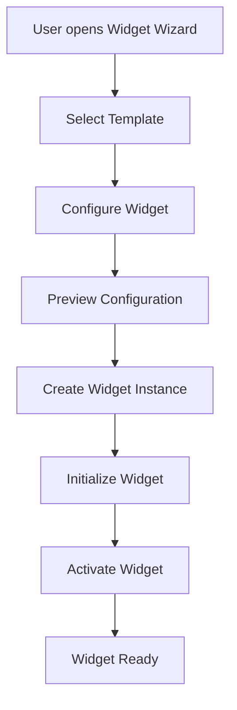
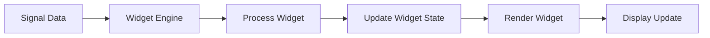
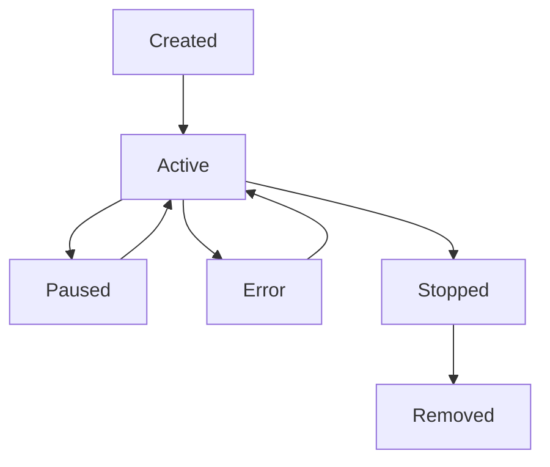

# Widget Wizard Infrastructure Documentation

## Overview

The Widget Wizard Infrastructure is the core extensibility mechanism for the Debug Player Framework. It provides a complete system for creating, managing, and deploying custom data visualization and analysis widgets without modifying the core system.

## Architecture

### Core Components

#### 1. Widget Engine (`/client/src/lib/widget-engine.ts`)
The central coordinator for widget lifecycle management.

**Key Features:**
- Dynamic widget registration and creation
- Widget lifecycle management (create, pause, resume, delete)
- Data broadcasting to subscribed widgets
- Configuration validation and management
- Real-time status monitoring

**Main Classes:**
- `WidgetEngine`: Core engine class
- `WidgetDefinition`: Widget template interface
- `WidgetInstance`: Running widget instance
- `WidgetImplementation`: Widget behavior implementation

#### 2. Widget Templates (`/client/src/lib/widget-templates.ts`)
Pre-built widget implementations for common use cases.

**Available Templates:**
- **Trajectory Visualizer**: Vehicle path and planned trajectory display
- **Speed Analyzer**: Vehicle speed pattern analysis
- **Signal Monitor**: Generic signal monitoring over time
- **Data Exporter**: Export filtered data in various formats

#### 3. Widget Wizard (`/client/src/components/widget-wizard/widget-wizard.tsx`)
Multi-step interface for creating new widgets.

**Workflow:**
1. Template selection from available options
2. Configuration with dynamic form fields
3. Preview and validation
4. Widget creation and deployment

#### 4. Widget Manager (`/client/src/components/widget-wizard/widget-manager.tsx`)
Management interface for existing widgets.

**Features:**
- Widget status monitoring
- Start/pause/stop controls
- Configuration editing
- Widget deletion
- Performance metrics

#### 5. Widget Dashboard (`/client/src/components/widget-wizard/widget-dashboard.tsx`)
Live view of active widgets with real-time updates.

**Capabilities:**
- Real-time widget rendering
- Status monitoring
- Performance tracking
- Quick widget creation

#### 6. Widget Renderer (`/client/src/components/widget-wizard/widget-renderer.tsx`)
Component for rendering individual widgets.

**Functions:**
- Widget content rendering
- Error handling and display
- Status visualization
- Real-time updates

## Usage Guide

### Creating a New Widget

#### Step 1: Access Widget Wizard
```typescript
// Navigate to Widget Manager page
// Click "Add Widget" button
// Widget Wizard dialog opens
```

#### Step 2: Select Template
```typescript
// Choose from available templates:
// - Trajectory Visualizer
// - Speed Analyzer
// - Signal Monitor
// - Data Exporter
```

#### Step 3: Configure Widget
```typescript
// Fill in widget configuration:
interface WidgetConfig {
  name: string;                    // Widget display name
  [configKey: string]: any;       // Template-specific configuration
}

// Example for Trajectory Visualizer:
const config = {
  name: "Vehicle Path Display",
  showPlannedPath: true,
  pathColor: "#8884d8",
  chartSize: "medium"
};
```

#### Step 4: Deploy Widget
```typescript
// Preview configuration
// Click "Create Widget"
// Widget is automatically deployed and activated
```

### Managing Existing Widgets

#### Widget Status Control
```typescript
// Available actions:
widgetEngine.setWidgetStatus(widgetId, 'active');   // Start widget
widgetEngine.setWidgetStatus(widgetId, 'paused');   // Pause widget
widgetEngine.setWidgetStatus(widgetId, 'stopped');  // Stop widget
```

#### Widget Configuration Updates
```typescript
// Update widget configuration:
await widgetEngine.updateWidgetConfig(widgetId, {
  newConfig: 'value',
  updatedSetting: true
});
```

#### Widget Removal
```typescript
// Remove widget permanently:
await widgetEngine.removeWidget(widgetId);
```

### Creating Custom Widget Templates

#### Define Widget Template
```typescript
const customWidgetTemplate: WidgetDefinition = {
  id: 'custom-widget',
  name: 'Custom Widget',
  type: 'custom_chart',
  category: 'visualization',
  version: '1.0.0',
  inputs: [
    {
      name: 'input_signal',
      type: 'signal',
      dataType: 'number',
      required: true,
      description: 'Input signal description'
    }
  ],
  outputs: [
    {
      name: 'output_chart',
      type: 'chart',
      dataType: 'object',
      description: 'Output chart data'
    }
  ],
  configSchema: {
    customOption: {
      type: 'boolean',
      default: true,
      description: 'Custom option description'
    }
  },
  implementation: customImplementation
};
```

#### Implement Widget Behavior
```typescript
const customImplementation: WidgetImplementation = {
  initialize: async (config: Record<string, any>) => {
    // Initialize widget with configuration
    console.log('Initializing with config:', config);
  },
  
  process: async (inputs: Record<string, any>) => {
    // Process input data
    const { input_signal } = inputs;
    
    // Perform custom processing
    const processedData = processSignal(input_signal);
    
    return {
      output_chart: processedData
    };
  },
  
  render: (data: Record<string, any>) => {
    // Render widget content
    return React.createElement('div', null, 'Custom widget content');
  },
  
  cleanup: async () => {
    // Optional cleanup function
    console.log('Widget cleanup');
  }
};
```

#### Register Custom Template
```typescript
// Register with widget engine
widgetEngine.registerWidget(customWidgetTemplate);
```

## Data Flow

### Widget Creation Flow


### Data Processing Flow


### Widget Lifecycle


## Configuration Schema

### Widget Definition Schema
```typescript
interface WidgetDefinition {
  id: string;                      // Unique widget identifier
  name: string;                    // Display name
  type: string;                    // Widget type identifier
  category: WidgetCategory;        // Widget category
  version: string;                 // Version string
  inputs: WidgetInput[];          // Input definitions
  outputs: WidgetOutput[];        // Output definitions
  configSchema: ConfigSchema;     // Configuration schema
  implementation: Implementation; // Widget behavior
}
```

### Configuration Field Types
```typescript
interface WidgetConfigField {
  type: 'string' | 'number' | 'boolean' | 'select' | 'array' | 'object';
  default?: any;                  // Default value
  options?: string[] | number[];  // Options for select fields
  validation?: WidgetValidation;  // Validation rules
  description?: string;           // Field description
}
```

## Error Handling

### Widget Creation Errors
```typescript
try {
  const widget = await widgetEngine.createWidget(
    definitionId,
    instanceId,
    name,
    config
  );
} catch (error) {
  if (error.message.includes('Widget definition not found')) {
    // Handle missing template
  } else if (error.message.includes('Config validation failed')) {
    // Handle invalid configuration
  }
}
```

### Widget Processing Errors
```typescript
// Widget engine automatically handles processing errors
// Failed widgets are marked with 'error' status
// Error details are stored in widget.metadata.error
```

## Performance Considerations

### Widget Optimization
- Widgets are processed asynchronously
- Failed widgets don't affect other widgets
- Memory usage is monitored and managed
- Processing is throttled for performance

### Data Broadcasting
- Efficient signal subscription system
- Only subscribed widgets receive data
- Batch processing for multiple widgets
- Automatic cleanup of unused subscriptions

## Integration Points

### Vehicle Data Integration
```typescript
// Widgets automatically receive vehicle data signals
// Common signals available:
// - w_car_pose_now_x_, w_car_pose_now_y (position)
// - current_speed_mps (speed)
// - front_left_wheel_speed, front_right_wheel_speed (wheel speeds)
// - steering_wheel_angle (steering)
```

### Database Integration
```typescript
// Widget instances are stored in database
// Configuration is persisted
// Status is tracked and logged
```

### Python Backend Integration
```typescript
// Widgets can process data from Python backend
// Real-time signal processing
// Integration with vehicle data plugins
```

## Testing

### Unit Tests
- Widget Engine functionality
- Template validation
- Configuration handling
- Error scenarios

### Integration Tests
- Widget Wizard workflow
- Widget Manager operations
- End-to-end widget lifecycle
- Data flow validation

### GUI/Visual Tests (Playwright)
- Widget wizard user interface interactions
- Widget manager interface testing
- Widget dashboard real-time updates
- Visual regression testing with screenshots
- Responsive design across different screen sizes

### Accessibility Tests
- Screen reader compatibility
- Keyboard navigation support
- Color contrast validation
- Focus management and indicators
- Modal dialog accessibility
- ARIA labeling and roles

### Performance Tests
- Widget processing speed
- Memory usage monitoring
- Data broadcasting efficiency
- Concurrent widget handling

## Deployment

### Production Deployment
1. Widget templates are loaded automatically
2. Widget engine initializes with built-in templates
3. User interface is accessible via navigation
4. Real-time updates are enabled

### Development Setup
1. Install dependencies: `npm install`
2. Start development server: `npm run dev`
3. Access Widget Manager at `/widget-manager`
4. Create and test widgets in development environment

### Testing Setup
1. Run unit tests: `npm test`
2. Run GUI tests: `npx playwright test`
3. Run visual tests: `npx playwright test tests/e2e/widget-visual.spec.ts`
4. Run accessibility tests: `npx playwright test tests/e2e/widget-accessibility.spec.ts`
5. Generate test report: `npx playwright show-report`

## Troubleshooting

### Common Issues

#### Widget Not Appearing
- Check widget status in Widget Manager
- Verify widget definition is registered
- Ensure required inputs are available

#### Configuration Errors
- Validate configuration schema
- Check for required fields
- Verify data types match schema

#### Processing Failures
- Check widget implementation
- Verify input data format
- Review error logs in widget metadata

### Debug Mode
```typescript
// Enable debug logging
localStorage.setItem('widget-debug', 'true');

// Check widget engine state
console.log('Definitions:', widgetEngine.getDefinitions());
console.log('Instances:', widgetEngine.getInstances());
```

## Future Extensions

### Planned Features
- Widget marketplace for sharing templates
- Advanced configuration validation
- Widget versioning and updates
- Performance analytics dashboard
- Custom widget builder UI

### Extension Points
- Custom widget categories
- Advanced data processing plugins
- Integration with external services
- Custom visualization libraries
- Real-time collaboration features

## API Reference

### Widget Engine API
```typescript
class WidgetEngine {
  registerWidget(definition: WidgetDefinition): void;
  createWidget(definitionId: string, instanceId: string, name: string, config: Record<string, any>): Promise<WidgetInstance>;
  processWidget(instanceId: string, inputData: Record<string, any>): Promise<void>;
  updateWidgetConfig(instanceId: string, config: Record<string, any>): Promise<void>;
  removeWidget(instanceId: string): Promise<void>;
  setWidgetStatus(instanceId: string, status: WidgetStatus): void;
  getDefinitions(): WidgetDefinition[];
  getInstances(): WidgetInstance[];
  getInstance(instanceId: string): WidgetInstance | undefined;
  broadcastData(signal: string, data: any): Promise<void>;
}
```

### Widget Template API
```typescript
interface WidgetImplementation {
  initialize(config: Record<string, any>): Promise<void>;
  process(inputs: Record<string, any>): Promise<Record<string, any>>;
  render(data: Record<string, any>): React.ReactNode;
  cleanup?(): Promise<void>;
}
```

---

**Version**: 1.0.0  
**Last Updated**: July 16, 2025  
**Authors**: Debug Player Framework Team
